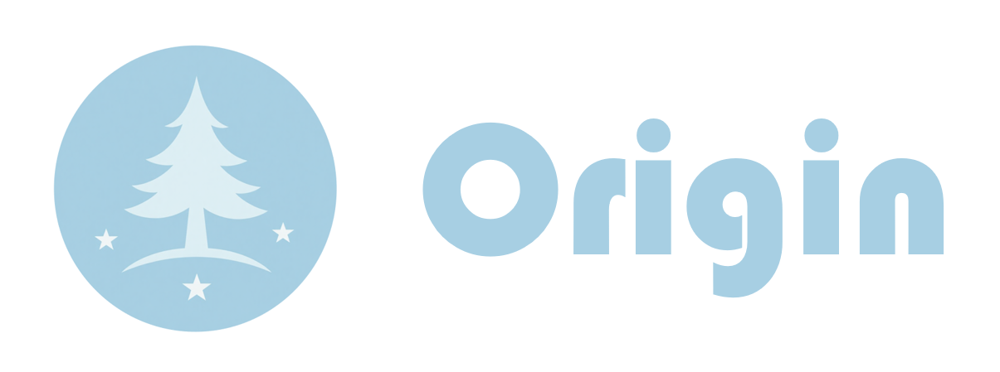
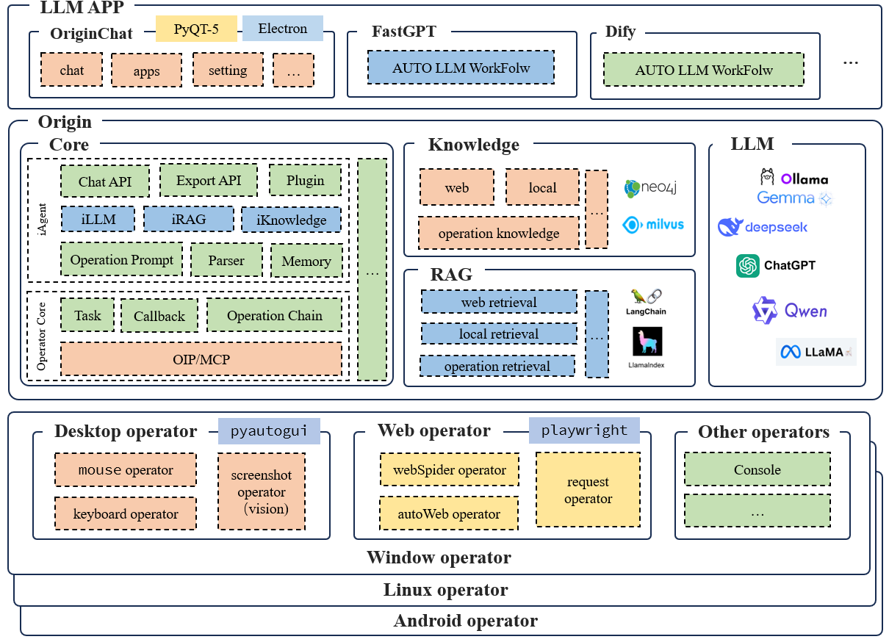

<!-- markdownlint-disable first-line-h1 -->
<!-- markdownlint-disable html -->
<!-- markdownlint-disable no-duplicate-header -->

  

  <a href="https://github.com/">Orgin Homepage</a> ·
  <a href="https://github.com/">Documentation</a> ·
  <a href="https://github.com/">contact me</a>

    
    
    
    

  
  
  

Origin is a LLM-driven operating system controller that can be used to implement fully automated GUI, WEB, and command line operations, supporting cross-platform, operation flow, task flow, and integrating knowledge base and RAG technology.Origin's goal is to become a high-performance, accurate, stable, and easy to extend the LLM for automated workflow construction tools.Origin urgently need more developers to participate in contributing it, my contact: phb@e.gzhu.edu.cn, and WeChat:RStar_hb, welcome anyone to fork the project or mention issue, thank you for supporting, sharing, spreading the project.lastly,let us together meet this future AI world!

## Introduction

this is the framework of origin:

## More information

this project is on developing, please wait for the next version.

## Contribute this project

we need more developers to participate in contributing it, welcome anyone to fork the project or mention issue, thank you for supporting, sharing, spreading the project.

## Contact

my contact: phb@e.gzhu.edu.cn, and WeChat:RStar_hb, welcome anyone to fork the project or mention issue, thank you for supporting, sharing, spreading the project.

