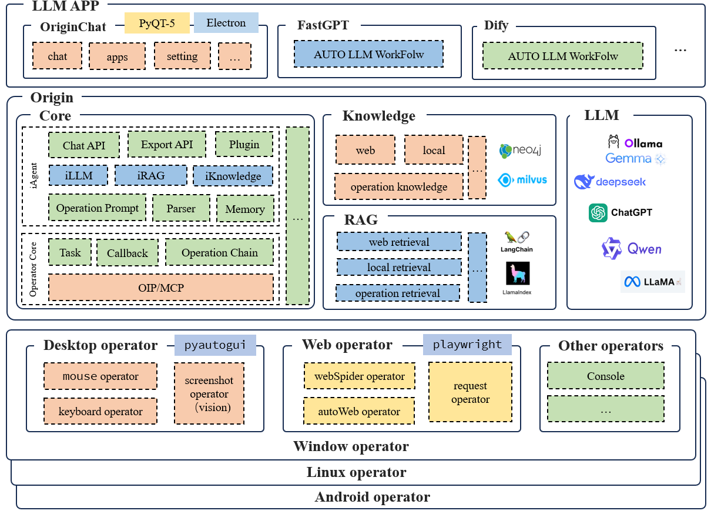

<!-- markdownlint-disable first-line-h1 -->
<!-- markdownlint-disable html -->
<!-- markdownlint-disable no-duplicate-header -->

  

  <a href="https://github.com/">Origin 主页</a> ·
  <a href="https://github.com/">文档</a> ·
  <a href="https://github.com/">联系我们</a>

    
    
    
    

  
  
  

Origin 是一个基于大型语言模型（LLM）驱动的操作系统控制器，可用于实现完全自动化的 GUI、WEB 和命令行操作，支持跨平台、操作流、任务流，并集成知识库和 RAG 技术。Origin 的目标是成为一个高性能、精准、稳定、易于扩展的 LLM 自动化工作流构建工具。Origin 急需更多开发者参与贡献，联系方式：phb@e.gzhu.edu.cn，或微信：RStar_hb。欢迎任何人 fork 项目或提出问题，非常感谢您对项目的支持、分享和传播。最后，让我们共同迎接未来的 AI 世界！

## 简介

以下是 Origin 的框架：

## 更多信息

项目正在开发中，请等待下一版本。

## 贡献此项目

我们需要更多开发者参与贡献，欢迎任何人 fork 项目或提出问题，非常感谢您对项目的支持、分享和传播。

## 联系方式

联系方式：phb@e.gzhu.edu.cn，微信：RStar_hb。欢迎任何人 fork 项目或提出问题，非常感谢您对项目的支持、分享和传播。
