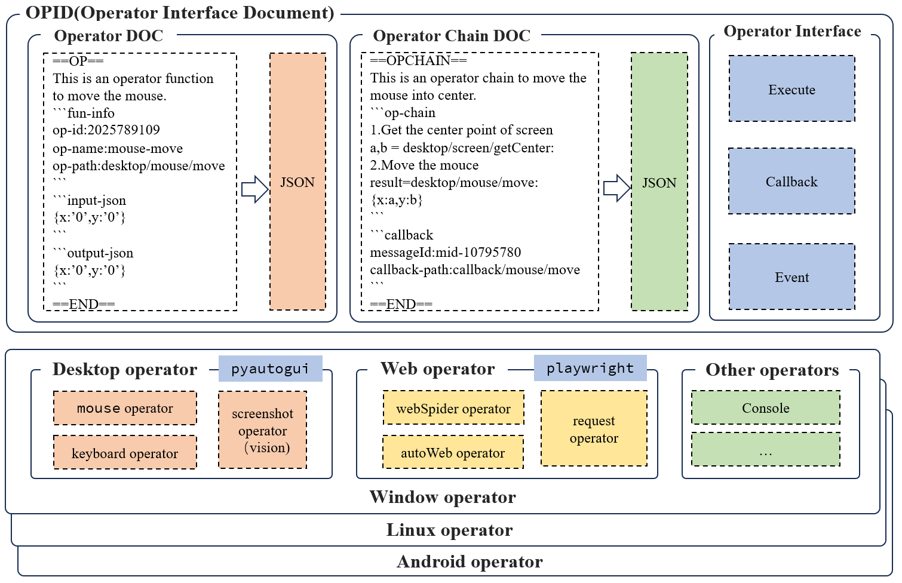

## OPID(Operator Interface Document)

OPID is one of the core concept of origin, it is the interface of 
artificial intelligence(LLM, etc.).The OPID is a descriptive document used to instruct LLM Agents on how to operate underlying systems or business interfaces (such as RestAPI), etc.

the framework of OPID is as follows:

